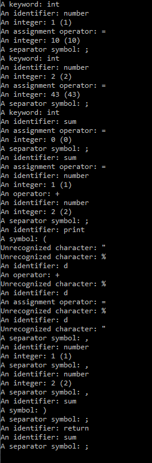

# Compiler-Construction Lab Assignment

[LAB 1](https://github.com/Sianwa/Compiler-Construction-LABS/blob/master/lab1.py)
I built a simple lexical analyser using python. Using a simple code declaration as an exmaple,'int result = 100', the program tokenizes the code.

[LAB 2]()
The second assignent was to describe the output of a lexical analyzer,
using the lexical analyzer created in [lab 1](https://github.com/Sianwa/Compiler-Construction-LABS/blob/master/lab1.py).
The output generated is:
`````
['KEYWORD', 'int'], 
['IDENTIFIER', 'result'],
['OPERATOR', '='],
['INTEGER', '10']
'10']

``````
The scanner identified four tokens from the sample code.

[Bonus FLEX Lab] (https://github.com/Sianwa/Compiler-Construction-LABS/tree/master/FLEX%20Lab)
FLex(Fast LEXical analyzer generator) is a tool for generating scanners. Instead of writing a scanner from scratch, you only need to identify the vocabulary of a certain language.( In this case its C Programming Langugae)
### Requirements
1. Installed FLEX
2. Installed MinGW

The lexical program is fond in the file [analyzer.l] (https://github.com/Sianwa/Compiler-Construction-LABS/blob/master/FLEX%20Lab/analyzer.l). It contains three sections 
``````
%{
//contains the global variables
%}

%%
Contains the rules and regular expressions
%%

main(){
//contains the main function for the lexical analyzer 
````````
we create a C file [lex.yy.c](https://github.com/Sianwa/Compiler-Construction-LABS/blob/master/FLEX%20Lab/lex.yy.c) which will now be used to compile into an executable [a.exe](https://github.com/Sianwa/Compiler-Construction-LABS/blob/master/FLEX%20Lab/a.exe).
The executable analyzes its input stream and transforms it into a sequence of tokens.

### Summary
1. analyzer.l is the form of pairs of regular expressions and C code.
2. lex.yy.c defines a routinr yylex() that uses the specificcation to recognize tokens.
3. a.out is the actual scanner

### Example
A C program to find the sum of two integers.
.png)

The output as seen in the terminal


